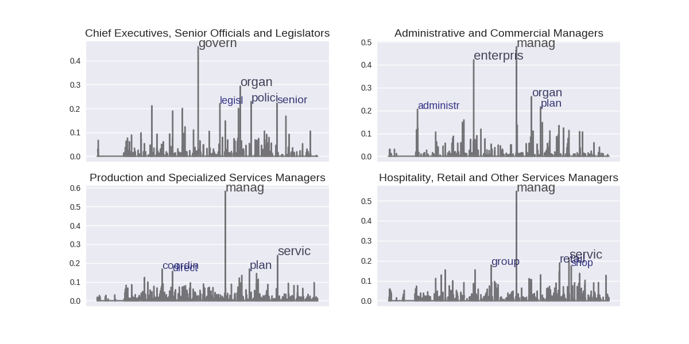
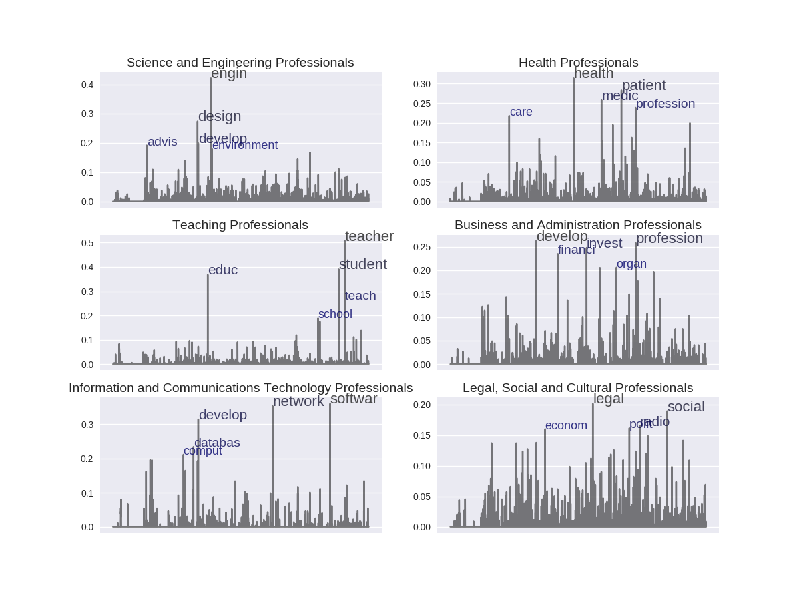
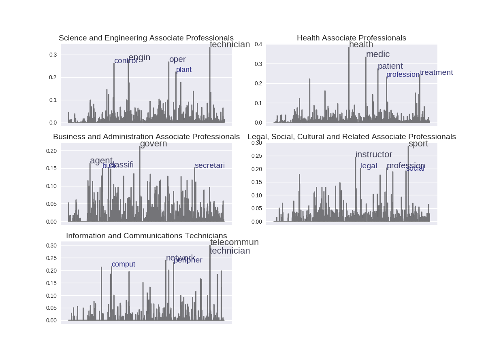
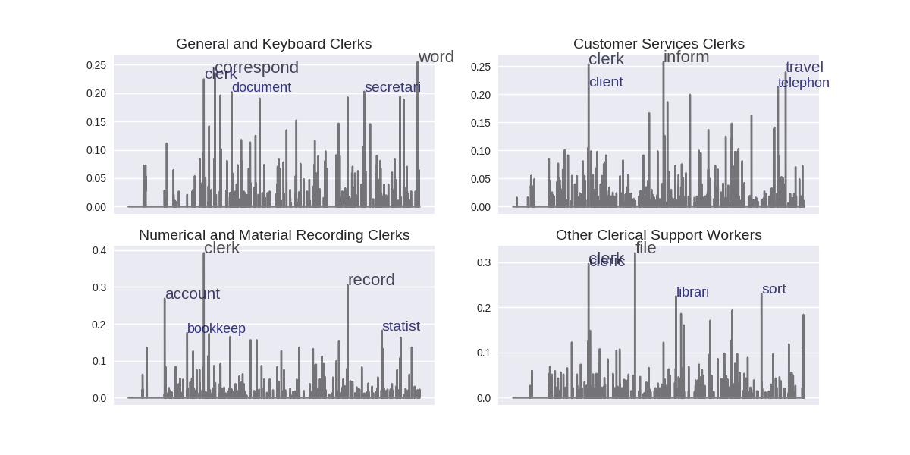
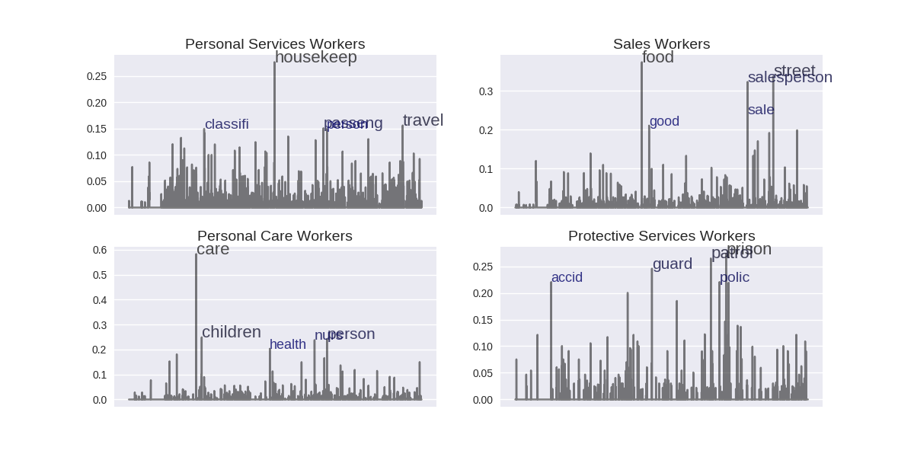
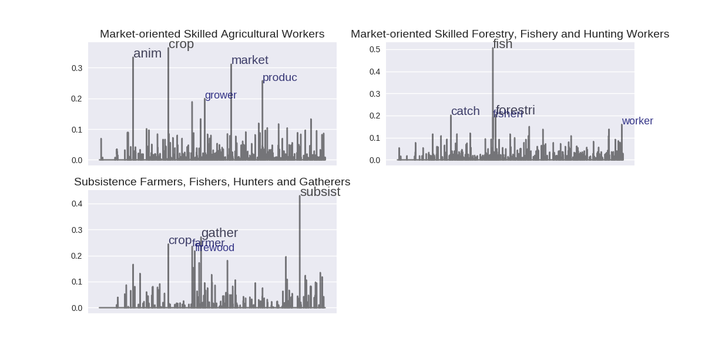
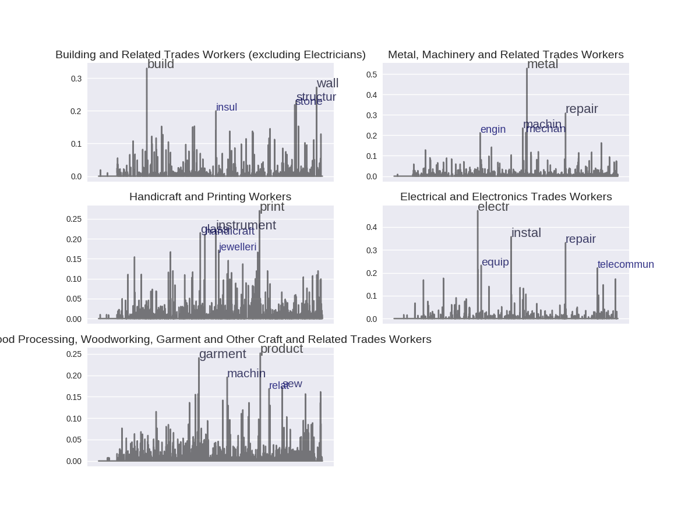
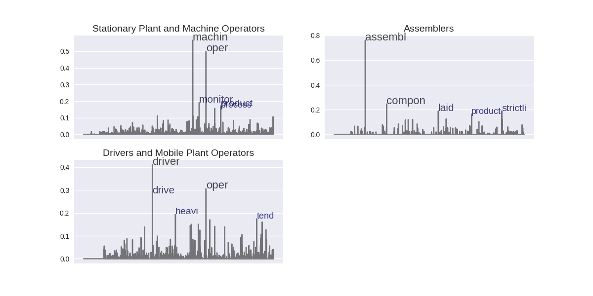
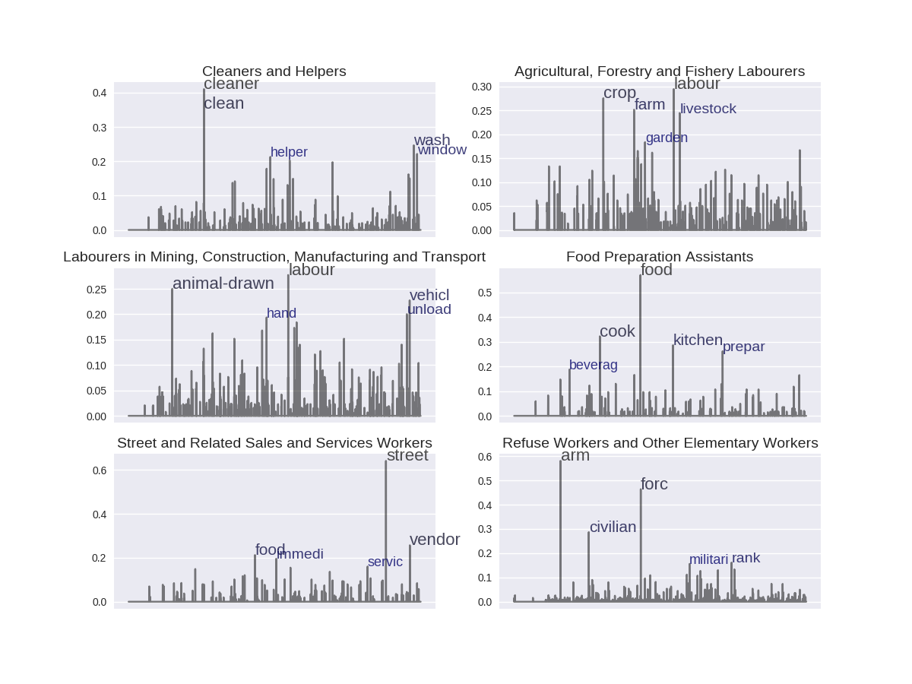

# Visualization of Interational Standard Classification of Occupation Dataset

## The original data is downloaded from: 
http://www.ilo.org/public/english/bureau/stat/isco/isco08/

- Parse occupations hierarchical data structure
- Parse the documents of occupation definition 
- Calculate tf-idf weights of words in each occupation
- Visualize frequent words used in different occupations

## Figures
- Level 1 Category : Managers

- Level 1 Category: Professionals

- Level 1 Category: Technicians and Associate Professionals

- Level 1 Category: Clerical Support Workers

- Level 1 Category: Services And Sales Workers

- Level 1 Category: Skilled Agricultural, Forestry and Fishery Workers

- Level 1 Category: Craft and Related Trades Workers

- Level 1 Category: Plant and Machine Operators and Assemblers

- Level 1 Category: Elementary Occupations

